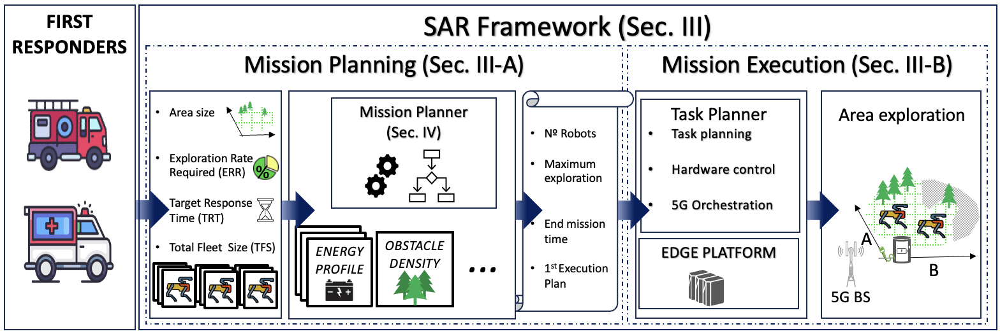

<p align="center">

  <h1 align="center">Cellular-enabled Collaborative Robots Planning and Operations for Search-and-Rescue Scenarios </h1>
  <p align="center">
    <a href=""><strong>Arnau Romero</strong></a>
    ·
    <a href=""><strong>Carmen Delgado</strong></a>
    ·
    <a href=""><strong>Lanfranco Zanzi</strong></a>
    ·
    <a href=""><strong>Raúl Suárez</strong></a>
    ·
    <a href=""><strong>Xavier Costa-Pérez</strong></a>
  </p>
</p>

<p align="center">

</p>


# EnergyProfile-GO1

The contains the datasets in which our ICRA 2024 paper has based its GO1 robot energy performance. We proposed a novel robotic SAR framework that
enhances state-of-the-art orchestration strategies for mobile collaborative robots by introducing a SAR mission planning phase. Specifically, we introduce a mission planning building block that takes into account readily available information to first responders such as the area to be explored and the
number of robots available and, considering mission goals such as exploration rate and response time, provides informed decisions on the number of robots required for a mission.


# About this Dataset repository

Datasets can be downloaded directly from the Datasets.zip file. Additionally, the authors have added a csv file under the Data Classification directory that indicates each experiment typology. By columns, there is a 1 when that component is actively being used or that action is being performed and a 0 when it is not.


# Citation

Consider citing this project work if it is helpful in your projects.

```bibtex
@InProceedings{romero2024SARFramework,
    title={Cellular-enabled Collaborative Robots Planning and Operations for Search-and-Rescue Scenarios},
    author={Arnau Romero, Carmen Delgado, Lanfranco Zanzi, Raúl Suárez, Xavier Costa-Pérez},
    booktitle={International Conference on Robotics and Automation},
    year={2024}
}
```

